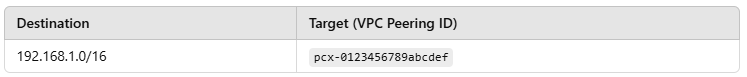
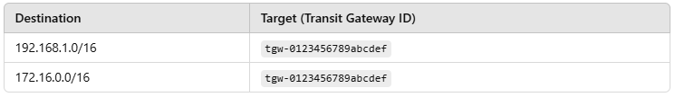

# VPC Peering, Transit Gateway, and PrivateLink in AWS
__AWS provides multiple ways to connect VPCs securely. The three main options are:__

* VPC Peering (Direct one-to-one connection between VPCs)
* Transit Gateway (Hub-and-spoke model for multiple VPCs)
* PrivateLink (Service-to-service private connectivity)

# VPC Peering
__What is VPC Peering?__
* VPC Peering allows two VPCs to directly communicate with each other privately using private IP addresses.

✅ When to Use:

* When you need direct communication between two VPCs.
* When you want a low-latency connection between VPCs in the same region.

🚫 Limitations:

* Only works for two VPCs at a time (one-to-one).
* Does NOT support transitive routing (i.e., if VPC A is connected to VPC B, and VPC B is connected to VPC C, A cannot communicate with C).

# Example Use Case: 
* Connecting Two Applications in Different VPCs

# Imagine you have:

* VPC A (10.0.0.0/16) hosting a web application.
* VPC B (192.168.1.0/16) hosting a database server.
* To allow the web application in VPC A to query the database in VPC B, you can create a VPC Peering connection.

🔹 Steps to Implement:

1. Create a VPC Peering Connection between VPC A and VPC B.
2. Update the route tables in both VPCs to allow traffic.
3. Now, resources in VPC A can reach VPC B using private IPs.

# Transit Gateway

__What is a Transit Gateway?__
A Transit Gateway (TGW) is a centralized routing hub that connects multiple VPCs and on-premises networks.

✅ When to Use:

* When you need to connect multiple VPCs (instead of creating many VPC peering connections).
* When you want transitive routing (VPC A can communicate with VPC C via the Transit Gateway).

🚫 Limitations:

* Slightly more expensive than VPC Peering.
* Complex routing configuration if managing many VPCs.

🔹 Example Use Case: Multi-VPC Network for a Large Organization
Imagine a company has:

1. VPC A (Web Servers) → 10.0.0.0/16
2. VPC B (Databases) → 192.168.1.0/16
3. VPC C (Logging & Monitoring) → 172.16.0.0/16
Instead of creating multiple peering connections, you use a Transit Gateway to act as a central hub.

🔹 Steps to Implement:

1. Create a Transit Gateway in AWS.
2. Attach VPC A, VPC B, and VPC C to the Transit Gateway.
3. Update the route tables in each VPC to send traffic to the TGW.
4. Now, all VPCs can talk to each other through the Transit Gateway.

🔹 Example Route Table in VPC A:

* Advantage: If new VPCs need to be connected, just attach them to the Transit Gateway instead of manually configuring peering.

# PrivateLink

__What is PrivateLink?__
* AWS PrivateLink allows you to securely connect services across different VPCs without exposing traffic to the public internet.

✅ When to Use:

* When you want to access AWS services (S3, DynamoDB, etc.) privately from your VPC.
* When you want secure communication between VPCs without peering or transit gateway.

🚫 Limitations:

* Works only for services (e.g., accessing a database or an API privately), not general VPC connectivity.

# Example Use Case: 
Accessing a Private API from Another VPC

Imagine we have:

* VPC A (Client VPC) → 10.0.0.0/16
* VPC B (API Service VPC) → 192.168.1.0/16
* VPC A needs to call an API hosted in VPC B privately. Instead of VPC Peering or Transit Gateway, you use PrivateLink.

🔹 Steps to Implement:

* In VPC B, create a PrivateLink Endpoint Service for the API.
* In VPC A, create a VPC Endpoint that connects to the PrivateLink service.
* The API traffic now flows securely over AWS PrivateLink without using public IPs.

# Example: How PrivateLink Works

* VPC A’s server calls: https://api.vpc-b.amazonaws.com
* The request stays within AWS private network (no internet exposure).

# Advantage:

* More secure than VPC Peering or Transit Gateway for API-based communication.
