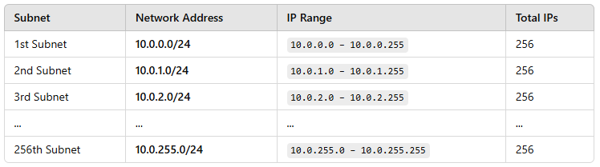

# AWS Networking Fundamentals__

**Defining an IP address range and a CIDR block is conceptually similar but not exactly the same**

__IP Address Range:__
This refers to a sequence of IP addresses, for example, 192.168.1.0 - 192.168.1.255 (256 addresses).

__CIDR Block (Classless Inter-Domain Routing)__
This is a way to specify an IP address range using a network prefix and a subnet mask, for example, 192.168.1.0/24, which represents 256 IP addresses.

__Example__
CIDR Block for a VPC
When you create an AWS VPC, you must define a CIDR block for it.

__For example__

If you define your VPC CIDR block as **10.0.0.0/16**, it means:
IP address range: 10.0.0.0 to 10.0.255.255
Total IPs available: 65,536 (2¹⁶)
You can create subnets within this range (e.g., 10.0.1.0/24, 10.0.2.0/24).

The CIDR notation /16 means that the first 16 bits of the address represent the network portion, while the remaining 16 bits are used for host addresses.

An IPv4 address consists of 32 bits, written in four octets (e.g., 10.0.0.0).
Step-by-Step Explanation

__Understanding /16 in CIDR Notation__
/16 means that the first 16 bits (10.0.) are fixed as the network address.
The remaining 16 bits (X.X) can be used to assign host addresses within the network.

__IP Address Range Calculation__
The starting IP is 10.0.0.0, where all host bits are 0s (network address).
The ending IP is 10.0.255.255, where all host bits are 1s (broadcast address).
The total number of IP addresses in this range is 2^(32-16) = 2^16 = 65,536.

Each octet in an IP address is 8 bits.
Since /16 locks the first 16 bits, the remaining 16 bits are available for host addresses.
The total number of combinations of these 16 bits is 2¹⁶ = 65,536.

__Subnetting Example__
If you divide this VPC (10.0.0.0/16) into smaller subnets, you can create:

10.0.0.0/24 → 256 IPs
10.0.1.0/24 → 256 IPs
10.0.2.0/24 → 256 IPs
... up to 10.0.255.0/24 (total 256 subnets)

__Step 1: Understanding the VPC CIDR Block (10.0.0.0/16)__
* The given VPC CIDR block is 10.0.0.0/16, which means:
* The first 16 bits (10.0.) are fixed for the network.
* The remaining 16 bits (X.X) are available for host addressing.
* The total number of IPs available in this VPC = 2^(32-16) = 65,536.

__Step 2: Breaking Down the /16 into /24 Subnets__
* A /24 subnet means that the first 24 bits are reserved for the network, leaving only 8 bits for hosts.
* Since our original VPC is /16, we can further divide it into smaller /24 subnets.
Each /24 subnet will have:
256 IP addresses (since 2⁸ = 256).
A range of 10.0.X.0 - 10.0.X.255.

__Step 3: Example of /24 Subnets__
* Since the original VPC CIDR is 10.0.0.0/16, we can create 256 subnets of size /24:

* Each subnet (/24) has 256 IPs, but AWS reserves 5 IPs per subnet, reducing usable IPs to 251 per subnet.

__Step 4: How Many /24 Subnets Can We Get?__
* The original VPC (/16) had 65,536 IPs.
* Each /24 subnet has 256 IPs.
* Total possible subnets = 65,536 / 256 = 256 subnets.

__Step 5: Why Subnetting?__
* Subnetting allows us to:

* Segment networks (e.g., separate public and private subnets).
* Improve security (e.g., restrict traffic between subnets).
* Manage resources better (e.g., avoid wasting IPs in large ranges).

